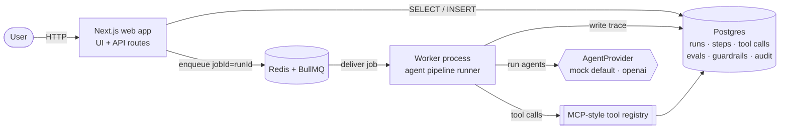
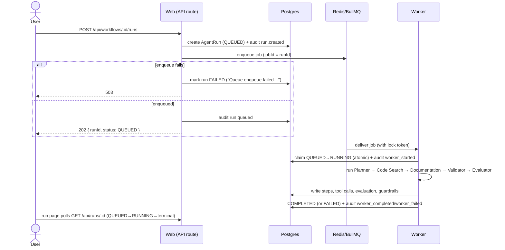
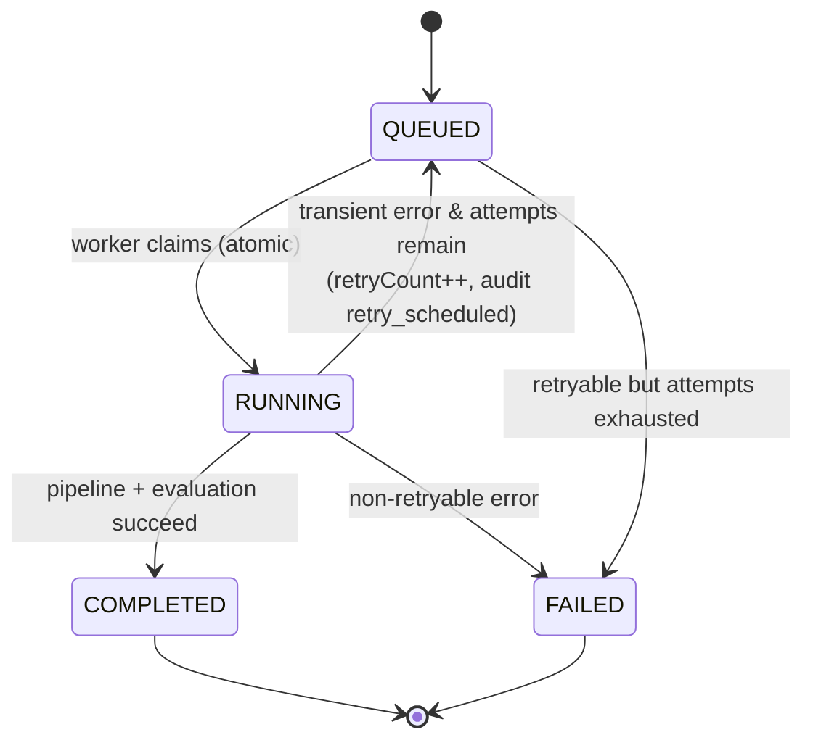

# Architecture

AgentOps is a two-process system — a **Next.js web app** and a standalone
**worker** — sharing a Postgres database, with a Redis-backed BullMQ queue
between them. The web app never executes runs; it enqueues them.

## System architecture

## Component responsibilities

| Component | Responsibility |
| --- | --- |
| **Web app** | Auth, dashboard, trace UI, and API routes. Creates `QUEUED` runs and enqueues one job each. Never runs a Worker. |
| **Worker** | The only place execution happens. Claims a job, runs the five-agent pipeline, writes steps/tool-calls/evaluation/guardrails, and finalizes the run. |
| **Postgres** | Source of truth for every persisted trace and the append-only audit log. |
| **Redis + BullMQ** | Job queue and bounded retry/backoff scheduling. |
| **AgentProvider** | Pluggable agent engine — deterministic `mock` (default, no key) or `openai`, selected by `AI_PROVIDER`. |

## Data flow — starting a run

## Retry lifecycle

Only explicitly classified **transient** failures (HTTP 408/429/5xx, connection
resets/timeouts) are retried, bounded by `AGENT_RUN_MAX_ATTEMPTS` with
exponential backoff. Everything else runs once. Before a retry attempt executes,
the previous attempt's detailed trace (steps, tool calls, evaluation,
guardrails) is reset; the full attempt history is preserved in `AuditLog` and
surfaced as the run's **Execution history** strip. Run-status copy is derived
only from persisted signals (`status`, `retryCount`, and audit metadata) — never
from the current environment.

## Delivery semantics — why not "exactly-once"

BullMQ provides **at-least-once** delivery. AgentOps reduces duplicate execution
with several database-backed safeguards:

- `jobId = runId` collapses duplicate enqueues of the same run.
- A **terminal-run no-op**: a job for an already-terminal run does nothing.
- An **atomic** `QUEUED`/stale-`RUNNING` → `RUNNING` status transition claims the run.
- A **best-effort ownership fence** using the BullMQ lock: a missing lock token
  aborts before any DB write, and before a trace reset or a terminal write the
  worker re-verifies the lock via `job.extendLock(token, lockDuration)` and does
  nothing on loss.

These make duplicate *effects* unlikely, but they are **not** a strict
exactly-once guarantee. Strict fencing against a worker that lost its lock but is
still mid-write would require a dedicated DB owner/fence column and compare-and-set
on every write — deliberately out of scope. Accordingly, the product makes **no
exactly-once claim** anywhere; the public UI states only the at-least-once
behavior and its mitigations.

## Key design decisions

- **Seed a full fake run before building the runner** — the trace UI was
  validated against seeded data first, de-risking the schema against its hardest
  screen (the timeline).
- **One `runTool()` logging wrapper** — every tool call is persisted uniformly
  (input/output/status/latency); logging can't be forgotten because it lives in
  one place. This *is* the MCP-style observability story.
- **Pluggable `AgentProvider`** — the runner has zero provider branches; the mock
  keeps demos and tests deterministic and free.
- **Retries preserve history** via `retryCount` + `AuditLog` rather than mutating
  a run in place.
- **Guardrail and audit writes are non-fatal** — observability plumbing must
  never fail the run it observes.
